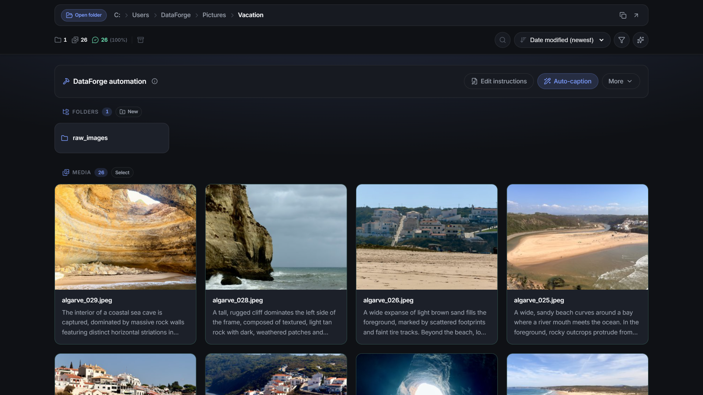

# DataForge

**Local-first gallery and automation for image and video caption datasets.**

Browse folders of media, edit captions, run automated AI jobs, and keep every sidecar next to your files.
Built for people who curate training data for generative models — LoRAs, fine-tunes, and similar workflows.

[](https://github.com/dremme/dataforge/actions/workflows/checks.yml)
[](LICENSE)
[](https://www.python.org/)
[](https://nodejs.org/)
[](#system-requirements)

[Quick start](#quick-start) · [Features](#features) · [Requirements](#system-requirements) · [Configuration](docs/configuration.md) · [Development](docs/development.md) · [Security](SECURITY.md) · [License](#license)



## Overview

Most dataset tools either push you into a cloud UI or leave you juggling scripts and folders.
DataForge is a **desktop web app** you run locally — no cloud account, no upload step, nothing leaves your machine.

- Your media and sidecars stay in **your** folder structure
- Captions save as standard `.txt` files next to each image or video
- Optional vision LLMs talk to a **local** OpenAI-compatible server
- Jobs run in the background with progress, cancel, and history

Ideal when you already keep datasets on disk and want a fast, visual workflow over them.

## Quick start

### Windows

**1. Setup (once)** — double-click `setup.bat` in the project root.
It downloads Python 3.12.6 → `.python/` and Node 20.19.0 → `.node/`, creates `backend/.venv`, installs all dependencies,
and generates the frontend's view of the backend API — see [Generated frontend code](docs/development.md#generated-frontend-code).

**2. Run** — double-click `start.bat`, or run `.\start.ps1` in PowerShell. The launcher:

- Regenerates the frontend's view of the backend API, so a branch switch cannot bundle a stale one
- Builds the frontend when a source changed since the last build, and skips it otherwise
- Frees the app port, if a previous run left a server behind
- Starts **one** server in its own console, serving the bundled UI and the API together
- Waits until it answers `/api/health`, *then* opens **http://localhost:8081**
- Stays open as a supervisor — press any key in it, or close it, to stop the server

Everything is served from a single origin on **http://localhost:8081** — no proxy hop, no hot-reload machinery.
The first launch spends a minute or two on the frontend build; later ones start in seconds.
The port is configurable; see [Server ports](docs/configuration.md#server-ports).

**3. Optional AI config** — copy `.env.example` to `.env` in the project root and set the `OPENAI_*` variables.
The backend loads `.env` automatically on startup. See [Configuration](docs/configuration.md).

**4. Daily use** — only `start.bat` is needed from then on. Re-run `setup.bat` to refresh dependencies.

To stop the server: press any key in the launcher window, close that window, or hit **Ctrl+C** in the server console.
All three stop the server cleanly. `stop.bat` is the fallback for the cases with no launcher watching — after
`-Detach`, or when the *server* console was closed with the X button and left its port held.

`start.bat` passes flags through to `start.ps1`:

| Flag | Effect |
| --- | --- |
| `-Rebuild` | Build the frontend even when it looks up to date |
| `-NoBuild` | Never build; serve whatever is already in `frontend/dist` |
| `-NoBrowser` | Do not open the browser |
| `-Detach` | Exit once the server is ready instead of supervising; stop it later with `stop.bat` |

Working on DataForge itself? Use `dev.bat` instead — see [Running with hot reload](docs/development.md#running-with-hot-reload).

### Linux, macOS, or a global Python/Node

Requires Python **3.11+** and Node **20+** with npm. From the **project root**:

```bash
# One-time setup
python -m venv backend/.venv
backend/.venv/bin/python -m pip install -r backend/requirements.txt -r backend/requirements-dev.txt
cd frontend && npm install && cd ..

# Required before the frontend will build — see docs/development.md
backend/.venv/bin/python scripts/generate_types.py

# Build the UI, then serve both halves from one process
cd frontend && npm run build && cd ..
backend/.venv/bin/python scripts/prod_server.py
```

Then open **http://localhost:8081**. Re-run `npm run build` after changing frontend sources —
`prod_server.py` serves whatever is in `frontend/dist`.

### Try the sample dataset

Point the app at [`sample-images/`](sample-images/) in this repo — a tiny folder with mixed caption states (`.txt`, uncaptioned, and one `.issue.json` where the caption calls autumn snow).

## Features

### Supported formats

Images are JPG, JPEG, PNG, WebP, BMP, and GIF; videos are MP4, AVI, MOV, MKV, WMV, M4V, and FLV — the same
set [AI-Toolkit](https://github.com/ostris/ai-toolkit) trains on, minus audio-only files and SVG. Everything
in that list lists, thumbnails, captions, and trains.

Three things are narrower than the list, because the formats themselves are:

- **In-app image editing** is JPG, JPEG, PNG, WebP, and BMP — every still except GIF, which carries a frame
  sequence that a single re-encode would flatten to one frame. A GIF keeps frame saving instead, which writes
  a new JPG and leaves the source untouched.
- **In-app video playback, frame saving, and editing** need a container the browser can decode, which means
  MP4, MOV, and M4V. An AVI, WMV, FLV, or MKV still gets a thumbnail and a caption; it just will not play in
  the detail view. Editing shares the limit because the editor drives its timeline and crop off that same
  player — ffmpeg would happily re-encode an MKV, but nothing would be there to scrub.
- **Megapixels, watermarking, and ComfyUI workflow detection** are MP4, MOV, and M4V only. The other
  containers hide their headers somewhere the readers here cannot reach, or cannot be re-muxed cleanly.

### Gallery and navigation

- Virtualized grid that stays smooth on large folders
- Live updates — the server watches the open folder and pushes changes, so files added, edited, or removed
  outside DataForge appear without a refresh
- Subfolders, breadcrumbs, favorites, and recent history
- Copy the current folder path, or open it in File Explorer (Windows)
- Drive and folder picker
- Search by file name, folder name, or caption, with optional regex (**Ctrl+K** / **⌘K** focuses search)
- Quick action bar (**Ctrl+Space**) — a Spotlight-style palette over subfolders, recent and favorite
  folders, jobs, every automation job, and app commands; arrow keys to move, Enter to run
- Filters for all / captioned / issues / missing caption, and images / videos (GIFs count as videos),
  plus a duplicates toggle that narrows whatever the other two chose
- Sort by name, modified date, caption length, or megapixels
- WebP thumbnails and a responsive layout
- Folder cards flag when a folder has caption issues or duplicates

### Captions and metadata

- In-place caption editing for `.txt` sidecars
- Issue resolver — step through flagged files to edit, resolve, or skip
- Duplicate resolver — walk each duplicate group side by side, with a suggested keeper, and delete the rest
  (on Windows they go to the Recycle Bin; elsewhere the deletion is confirmed by name first)
- Click-to-zoom in the detail and issue-resolver views
- Open the current image in the OS image viewer (Windows)
- Save any playable video or GIF frame as a JPG beside the source; scrub to the frame and the filename carries its timestamp (video) or frame index (GIF), so each frame is its own file
- Image editing in place — crop, rotate in quarter turns, mirror, and rescale, on the same terms: one pass
  from the same stored original, so a later change keeps the rest and Revert puts it back. The crop rectangle
  turns with the preview, so it always frames the pixels you can see
- Video editing in place — trim, crop, speed up or slow down, and rescale, applied in one pass. The original
  is stored once as `<name>.<ext>.bak` and every edit re-renders from it, so changing one setting later keeps
  the rest and nothing is ever an encode of an encode. Revert restores it
- Per-folder `.sysprompt` (markdown) to steer AI captioning
- Caption status on cards and in the detail view
- Dataset statistics drawer — caption coverage, files missing a caption, caption issues and duplicate
  groups, caption-length spread, the most frequent caption words, media types, and megapixel buckets;
  always the whole folder, not the filtered view
- Detection of embedded ComfyUI workflows in PNGs and MP4-family videos
- Drag-and-drop import for media, sidecars, and `.sysprompt`
- Delete media along with matching sidecars, including `.issue.json`, `.duplicate.json`, and a stored
  original from image or video editing
- Move or copy selected files, and create subfolders

### Automation jobs

Jobs run in the background, with a drawer for progress, cancel, and history. Progress is pushed over the same
event stream the gallery uses, so the drawer and automation panel follow a running job as it goes:

| Job | What it does |
| --- | --- |
| **Auto-caption** | Completes short drafts with a local vision LLM (reasoning or instruct mode, with a **[reasoning effort](docs/configuration.md#reasoning-effort)** setting), optionally sending each clip's **[audio](docs/configuration.md#audio-captioning)** alongside its keyframes |
| **Set captions** | Apply the same text to many files |
| **Find & replace** | Bulk caption edits — replace matching text (literal or regex), or prepend and append a trigger word — with a live count and before/after samples that highlight the changed span before anything is written |
| **Edit captions** | Rewrites every caption from an instruction you write ("shorten to one sentence", "present tense") using the local LLM. Text only — the media is never sent — and originals go to `.backup` by default so **Restore captions** undoes the run; a reply that comes back empty or wildly longer or shorter is counted `rejected` and its caption left untouched |
| **Verify captions** | Checks captions against the media — videos via keyframes, GIFs as stills — and writes `.issue.json` per file when something is wrong, leaving the rest of the folder's findings alone |
| **Find duplicates** | Perceptually hashes the folder and groups the matches at an **exact**, **near**, or **loose** threshold, writing each member a `.duplicate.json`; the duplicates filter and the duplicate resolver then work through the groups |
| **Quick LoRA training** | Start a LoRA run on the current folder in AI-Toolkit, on Krea 2 Turbo (images) or MiniMax H3 (video) |
| **Rename** | Numbered rename of media plus related sidecars |
| **Watermark** | Burn text onto JPG, PNG, WebP, BMP, MP4, MOV, and M4V copies in a `watermarked` subfolder (size, opacity, position) |
| **Strip metadata** | Remove embedded data from PNGs and MP4s |
| **Backup captions** | Copy captions and caption issues into `.backup`, keeping copies already stored there unless you opt to overwrite |
| **Restore captions** | Restore captions and issues from `.backup` |

External **Ostris / AI-Toolkit** training jobs also appear in the jobs drawer once [configured](docs/configuration.md#paths-integrations-and-logging).

Quick LoRA training needs AI-Toolkit running on `http://127.0.0.1:8675`; the menu entry stays disabled otherwise. The dialog's **Edit template** button opens that model's YAML from `ostris-templates/` so a single run can change steps, learning rate or resolution; the edit applies to that run only and the file on disk is never written.
AI-Toolkit owns the run and its training folder, while DataForge tracks it like any other job — progress and sample
images in the automation panel, and an external card in the jobs drawer.

### Where your data lives

| Kind | Location |
| --- | --- |
| Captions, caption issues, duplicate groups, `.sysprompt` | Next to your media, so they travel with the dataset |
| Edit originals (`.bak`) and the edit that produced the current file (`.edit.json`) | Next to the image or video; hidden from the gallery, and carried along by move, copy, rename, and delete |
| App preferences, job history, thumbnails | `backend/data/` — gitignored SQLite plus cache |
| UI session state (search, gallery filters) | Browser session storage |

Verify-captions **additional context** is stored **per folder** in the app database, and UI preferences
(sort order, automation spec visibility) are stored server-side rather than only in the browser.

## System requirements

### App only

Enough for gallery browsing, caption editing, image and video editing, strip metadata, watermark, set
captions, and rename. Video work uses the ffmpeg that ships with the Python dependencies, image work uses
Pillow — no GPU involved.

| | Minimum | Recommended |
| --- | --- | --- |
| **OS** | Windows 10/11, Linux, or macOS | Windows 11 or a recent Linux |
| **CPU** | Dual-core, 64-bit | Quad-core or better |
| **RAM** | 8 GB | 16 GB |
| **Disk** | ~2 GB free for app and dependencies | SSD, with room for datasets and thumbnails |
| **Software** | Python / Node, or Windows `setup.bat` — see [Quick start](#quick-start) | Same |

### Vision LLM jobs

Hardware here is driven by **the model you load** in llama.cpp, Unsloth, or similar — not by DataForge,
which only calls an OpenAI-compatible HTTP endpoint.

| | Minimum (lighter models) | Optimal (recommended models) |
| --- | --- | --- |
| **GPU** | NVIDIA with **8–12 GB** VRAM | NVIDIA with **24 GB** VRAM (RTX 3090 / 4090 class) |
| **System RAM** | **16 GB** | **32 GB** or more |
| **Storage** | Fast SSD with room for weights (several GB to tens of GB per quant) | NVMe SSD |
| **Typical models** | [Qwen3 VL 8B Instruct](https://huggingface.co/Qwen/Qwen3-VL-8B-Instruct), [Qwen3.5 9B](https://huggingface.co/Qwen/Qwen3.5-9B) (quantized) | [Qwen3.6 35B A3B](https://huggingface.co/Qwen/Qwen3.6-35B-A3B), [Qwen3.6 27B](https://huggingface.co/Qwen/Qwen3.6-27B) |
| **Software** | A local OpenAI-compatible vision server with a vision model loaded | Same, with VRAM for quality quants and longer contexts |

[Audio captioning](docs/configuration.md#audio-captioning) additionally needs an omni model that accepts audio input.

## Configuration

Copy [`.env.example`](.env.example) to `.env` in the project root and restart the backend after editing.
The file is gitignored. OS and shell environment variables always win over it.

For AI jobs, set the `OPENAI_*` variables so DataForge can reach a local OpenAI-compatible vision server.
The defaults assume that server is on `http://127.0.0.1:8888/v1`.

| Variable | Default | Purpose |
| --- | --- | --- |
| `DATAFORGE_API_PORT` | `8080` | **Development only** — port the API binds, and the Vite `/api` proxy target |
| `DATAFORGE_UI_PORT` | `8081` | The port you open |

Ports, model choices, audio captioning, sampling knobs, and integration paths are in
**[Configuration.md](docs/configuration.md)**.

## Development

Working on DataForge itself? Use `dev.bat` (or `.\dev.ps1`) instead of `start.bat` — two consoles, hot reload,
and Vite proxying `/api`.

Launcher flags, project layout, generated frontend types, and the command list are in
**[Development.md](docs/development.md)**.

## Security and privacy

- Sidecars live alongside your datasets; app state stays under gitignored `backend/data/`
- Do not commit real API keys, personal paths, or local caches
- See **[SECURITY.md](SECURITY.md)** for reporting issues and local-data guidance

## Contributing

Issues and pull requests are welcome — open one if something is missing or broken.

Before submitting, run `python scripts/run_checks.py` from the project root; it runs the same lint, typecheck,
and test suite as [CI](.github/workflows/checks.yml). Installing the git hooks with `scripts/install-git-hooks.ps1`
(or `.sh`) does this automatically. Coding conventions live in [AGENTS.md](AGENTS.md).

## License

Licensed under the [Apache License 2.0](LICENSE).
