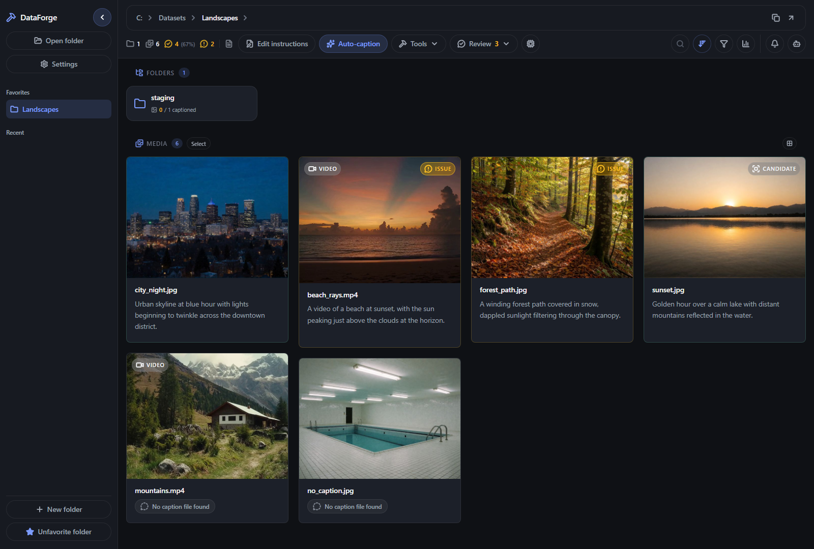

# DataForge

**A local gallery and automation app for image and video caption datasets.**

[](https://github.com/dremme/dataforge/actions/workflows/checks.yml)
[](LICENSE)
[](https://www.python.org/)
[](https://nodejs.org/)
[](docs/getting-started.md#requirements)



Browse, caption, review, and edit datasets for LoRA training and fine-tuning. Open an existing folder: captions stay in plain `.txt` files beside the media, without a separate library or required import step.

## Quick start

[Download and extract the project](docs/getting-started.md#install-and-run), or clone it with Git.

- **Windows:** run `setup.bat` once, then `start.bat`. Setup downloads its own Python and Node; no global installation is needed.
- **Linux and macOS:** install Python 3.12+ and a [supported Node version](docs/getting-started.md#requirements), then run:

  ```bash
  ./setup.sh
  ./start.sh
  ```

The app opens at `http://localhost:18081`. Try [`sample_images/`](sample_images/) for an example dataset. See [Getting started](docs/getting-started.md) for updating and troubleshooting.

## What it does

- **Browse and organize:** live folder updates, search and regex, filters, sorting, card/list views, and file operations.
- **Caption:** manual editing with autosave, backups, and word completion; bulk set, find & replace, and AI rewriting.
- **Auto-caption:** generate image and video captions with an OpenAI-compatible vision model, optionally including video audio.
- **Review:** model checks, caption-rule linting, near-duplicate detection, and dataset statistics.
- **Edit media:** crop, resize, color adjustment, Auto-adjust, video trim/speed/audio, and blur or blackout regions. Editor changes retain originals for reversion.
- **Process:** run ComfyUI workflows and review results before accepting them individually or in bulk.
- **Train:** start and monitor LoRA training on the current folder through AI-Toolkit.

AI is optional. Browsing, manual captioning, editing, and most bulk tools work without a model. Install and run any services you need separately, then connect them in **Settings**:

| Service                         | Default address            | Guide                                                         |
| ------------------------------- | -------------------------- | ------------------------------------------------------------- |
| OpenAI-compatible vision server | `http://127.0.0.1:8888/v1` | [Configuration](docs/configuration.md#connect-a-vision-model) |
| ComfyUI                         | `http://127.0.0.1:9000`    | [ComfyUI](docs/comfyui.md)                                    |
| AI-Toolkit                      | `http://127.0.0.1:8675`    | [LoRA training](docs/ai-toolkit.md)                           |

<a id="your-data-stays-local"></a>

## Data and storage

Captions, instructions, findings, and edit originals live with the dataset; app state and thumbnails default to `backend/data/`. Integrations default to local addresses. A remote endpoint receives that job's inputs; see [data sent to integrations](docs/configuration.md#data-sent-to-integrations).

Accepting a ComfyUI result replaces its source without a backup. Metadata stripping also has no built-in undo. The guides explain these limits beside each operation.

## Documentation

| Guide                                      | Covers                                                                     |
| ------------------------------------------ | -------------------------------------------------------------------------- |
| [Getting started](docs/getting-started.md) | Install, run, update, and troubleshoot startup                             |
| [User guide](docs/user-guide.md)           | Browse, caption, review, edit, and run jobs; formats, files, and shortcuts |
| [Configuration](docs/configuration.md)     | Recommended models, Settings, input budgets, and environment variables     |
| [ComfyUI](docs/comfyui.md)                 | Process media, review results, and create workflow presets                 |
| [AI-Toolkit](docs/ai-toolkit.md)           | Choose a template, start training, and monitor LoRA runs                   |
| [Development](docs/development.md)         | Hot reload, generated code, checks, CI, and versioning                     |

The [documentation index](docs/README.md) also links directly to common tasks.

## Contributing

Issues and pull requests are welcome. Read [Development](docs/development.md) and [AGENTS.md](AGENTS.md), then run the full checks from the project root:

```bash
backend/.venv/Scripts/python scripts/run_checks.py --fix
```

On Linux and macOS, use `backend/.venv/bin/python`. Report vulnerabilities privately following [SECURITY.md](SECURITY.md).

## License

[Apache License 2.0](LICENSE)
